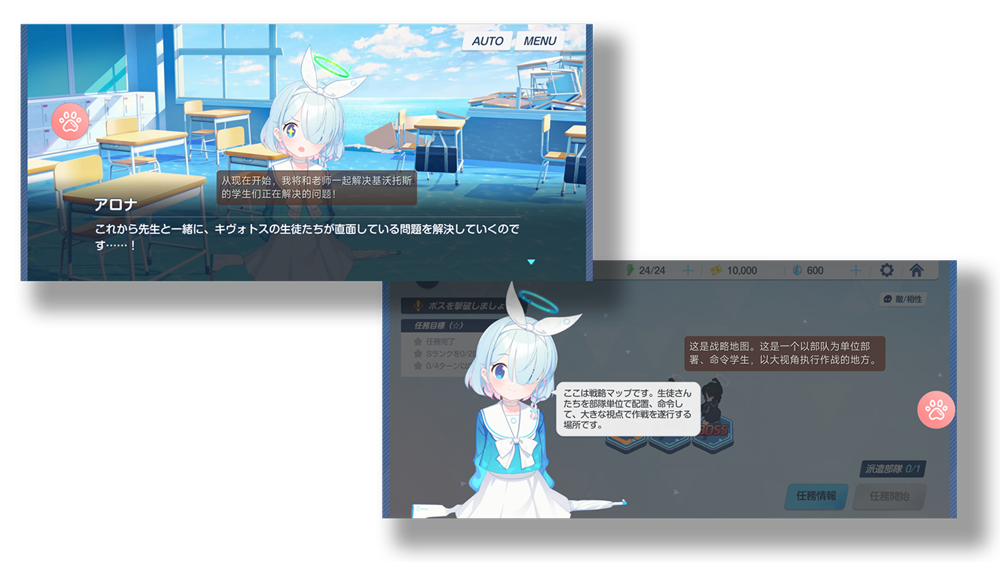
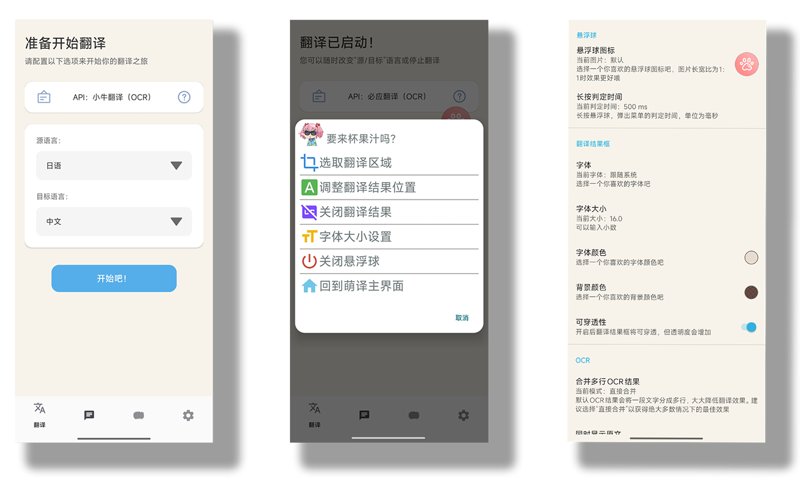
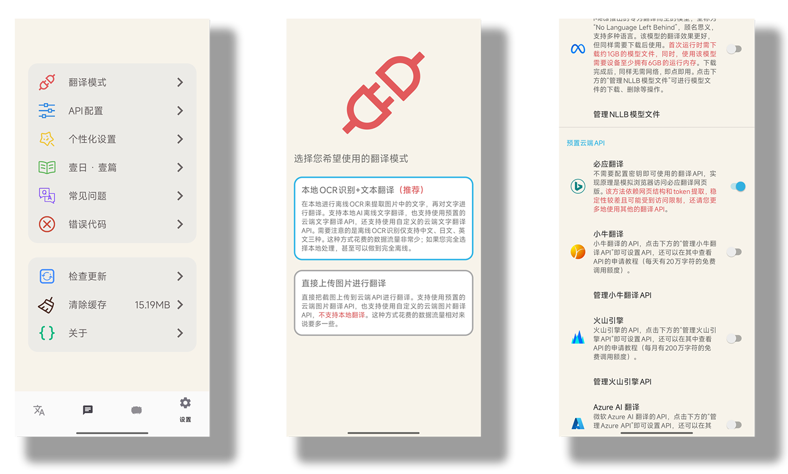

# GenOuka版本：萌译MoeTranslate

一键翻译图片文字内容，让您和非中文游戏的距离不再遥远。

[点击这里前往原版仓库](https://github.com/murangogo/MoeTranslate)

## 本版本与原版的区别

简单说这个版本就是为了本人个人需要而制作的版本，因为改动太大所以我不会主动向原仓库合并。

功能性差异：

* 删除了Live2d相关功能（虽然本人很喜欢鹿目圆但不想在软件里面看到，个人原因）
* 长按悬浮窗分三档：短按带上结果并翻译，中按不带上次结果并翻译。长按弹出菜单。设置可以调整长按时长
* 我不明白作者为什么要阻止按对话框外部关闭，我觉得不方便所以把它删了
* 删除了检查更新，因为这是第三方版本，避免引起用户的困惑和混乱
* 悬浮窗透明度调低，方便看图标后面的字，减少侵入感

技术性内容：

* 我这边编译环境和作者不一样，微调了一下编译选项

开源协议：

LGPL3.0，和原协议一致，也欢迎作者根据用户痛点反向移植，如果能署上我的名字就更好了www。

## 简介

萌译是一款安卓端的翻译软件，基于Android 11+的无障碍截图权限开发。

支持两种模式：

- **本地OCR识别+文本翻译：** 通过ML Kit实现**本地**OCR识别（支持的源语言有中文、日文、英文），然后将识别到的文字使用特定API进行翻译，获取翻译结果。
  
- **直接上传图片进行翻译：** 将截图直接上传给特定API，获取翻译结果，适用于源语言不是中文、日文、英文的情况。

## 一、翻译功能

翻译是萌译的核心功能，对于上述两种模式，分别支持不同的API，每个API的申请方法在萌译官网中都有[详细的教程](https://www.moetranslate.top/docs/translation/apiconfig/)（视频教程、图文教程）。

除此之外，您还可以**自定义API接口**来进行翻译，上述两种模式均支持自定义API接口，也就是说，**您可以在局域网内的电脑上搭建您喜欢的翻译服务（如：对接GPT、搭建Sakura本地翻译模型），然后通过萌译在手机上享受这些服务带来的便利**。这种方法需要您掌握一定的编程知识和计算机网络知识，在萌译官网上有一些简易的[搭建教程](https://www.moetranslate.top/docs/translationapi/customtext/)。

### 1、使用方法

简易的使用方法介绍如下图所示，更详细的使用方法在您初次使用App时会有详细的介绍，您也可[点击此处](https://www.moetranslate.top/docs/usetranslation/)去官网查看更详细的使用方法。

### 2、预置API介绍

- **本地OCR识别+文本翻译：** 这是比较推荐的一种翻译方式，预置支持的API有：

> **ML Kit翻译：** 属于本地AI翻译。除了第一次使用需下载模型（约100MB）外，其余时间可离线使用。搭配本地OCR识别，可实现全程离线翻译。值得注意的是，由于该模型体积很小，因此翻译质量较低，适合特殊情况下使用。  
> [启用教程](https://www.moetranslate.top/docs/translationapi/mlkit/)  
> 翻译质量：★（1星）

> **NLLB翻译：** 属于本地AI翻译。除了第一次使用需下载模型（约1GB）外，其余时间可离线使用。搭配本地OCR识别，可实现全程离线翻译。该模型相较于前者，翻译质量有所提升，支持的目标语言也更多，但受限于手机端算力，翻译质量相较于在线API差距仍然很大。  
> [启用教程](https://www.moetranslate.top/docs/translationapi/nllb/)  
> 翻译质量：★★（2星）

> **必应翻译：** 属于在线翻译API。这是唯一一个不需要提前配置API Key即可使用的在线翻译方式。其实现原理是通过模拟浏览器访问网页的行为来实现翻译，依赖于网页结构和token提取，这是非常不规范的行为，稳定性较差。也正因为如此，萌译无法保证它随时可用。该方法翻译质量尚可，不过由于它实现方式的特殊性，还是适合特殊情况下使用。  
> [启用教程](https://www.moetranslate.top/docs/translationapi/bing/)  
> 翻译质量：★★★★（4星）

> **小牛翻译：** 属于在线翻译API。需要提前配置API Key方可使用。注册后即可享受**每天20万字符的免费调用额度**，一般用户足够使用。API申请方法也非常简单，翻译质量很高，综合考虑的不二之选。  
> [申请教程](https://www.moetranslate.top/docs/translationapi/niutrans/)  
> 翻译质量：★★★★★（5星）

> **火山引擎：** 属于在线翻译API。需要提前配置API Key方可使用。这是字节跳动旗下的翻译API，注册后即可享受**每月200万字符的免费调用额度**，一般用户足够使用。API申请方法相比小牛翻译要复杂一些，翻译质量较高。  
> [申请教程](https://www.moetranslate.top/docs/translationapi/volc/)  
> 翻译质量：★★★★✬（4.5星）

> **Azure AI 翻译：** 属于在线翻译API。需要提前配置API Key方可使用。这是微软旗下的翻译API，实际上就是必应翻译的API版，注册后即可享受**每月200万字符的免费调用额度**，一般用户足够使用。API申请方法比较复杂，翻译质量尚可。  
> [申请教程](https://www.moetranslate.top/docs/translationapi/azure/)  
> 翻译质量：★★★★（4星）

> **百度翻译：** 属于在线翻译API。需要提前配置API Key方可使用。注册后即可享受**每月100万字符的免费调用额度**，一般用户足够使用。API申请方法比较简单，翻译质量一般。  
> [申请教程](https://www.moetranslate.top/docs/translationapi/baidu/)  
> 翻译质量：★★★✬（3.5星）

> **腾讯云：** 属于在线翻译API。需要提前配置API Key方可使用。注册后即可享受**每月500万字符的免费调用额度**，免费额度很大。API申请方法稍微复杂一些，翻译质量很一般。  
> [申请教程](https://www.moetranslate.top/docs/translationapi/tencent/)  
> 翻译质量：★★★（3星）

- **直接上传图片进行翻译：** 直接把截图上传给设定的API来翻译，预置支持的API有：

> **百度翻译：** 属于在线翻译API。需要提前配置API Key方可使用。注册后即可享受**每月1万次的图片翻译免费调用次数**，一般用户足够使用。API申请方法比较简单，和上面的文字翻译相比，带来的质量提升主要在OCR的精准度上。  
> [申请教程](https://www.moetranslate.top/docs/translationapi/baidu/)  
> 翻译质量：★★★★（4星）

> **腾讯云：** 属于在线翻译API。需要提前配置API Key方可使用。注册后即可享受**每月1万次的图片翻译免费调用次数**，一般用户足够使用。API申请方法稍微复杂一些，由于腾讯云的图片翻译仅支持单行翻译，因此当一句话多于一行时，会造成翻译严重不正确的情况。  
> [申请教程](https://www.moetranslate.top/docs/translationapi/tencent/)  
> 翻译质量：★★（2星）

## 使用到的其他开源项目

- [RTranslator](https://github.com/niedev/RTranslator)  
  本地运行的适用于 Android 的开源实时翻译应用程序。萌译中的NLLB翻译功能使用了RTranslator项目的模型和代码。

- [Live 2D SDK](https://www.live2d.com/)  
  用于展示和操作 Live2D 模型的框架。萌译的Live 2D功能使用到了Live 2D SDK。

- [ColorPicker](https://github.com/jaredrummler/ColorPicker)  
  Android 的颜色选择器组件。

- [Konfetti](https://github.com/DanielMartinus/Konfetti)  
  Android 的粒子效果库，用于创建炫酷的视觉效果。

更多使用到的基础开源项目请在萌译中的【设置】->【关于】->【开放源代码声明】中查看。